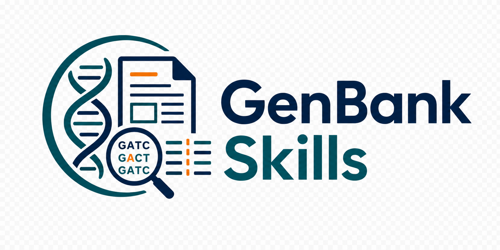

# GenBank Skills



## Purpose

GenBank Skills is a Codex-oriented toolkit for GenBank and HCV sequence workflows. It packages repeatable local scripts as skills so an agent can fetch GenBank records, extract metadata, align sequences, prepare HCV references, and build HCV NS3/NS5A/NS5B analysis outputs with consistent repository-local instructions.

Use this repository when you want the agent to run a named workflow from a prompt instead of manually coordinating many scripts and intermediate files.

## How To Use

Start in Codex and ask for the skill by name:

```text
Use $genbank-single-accession-extractor to download accession PV289040 and summarize the extracted GenBank metadata.
```

For HCV workflows, keep shared configuration files in the repository root:

- `.env`
- `pipeline.local.toml`

Each skill owns its detailed inputs, outputs, dependencies, and run instructions in its `SKILL.md`. Open the relevant skill folder when you need exact command-line flags or workflow-specific warnings.

Direct script execution is also supported. Use `uv run python ...` for Python entry points unless a skill documents a shell workflow wrapper.

## Skills

- `genbank-single-accession-extractor/`: Download one GenBank accession and extract FASTA, organism, reference, and source-feature metadata.
- `genbank-reference-alignment/`: Align accessions or query FASTA records against a reference FASTA and report best matched genes/ranges.
- `genbank-accession-list-metadata/`: Build cohort metadata and person/quasispecies summaries from accessions or a local GenBank file.
- `genbank-gene-split-alignment/`: Split GenBank nucleotide records by best matched reference gene and write per-gene aligned FASTA files.
- `hcv-gene-genotype-subtype-ref-alignment/`: Prepare reusable HCV genotype/subtype reference alignments and FASTA files.
- `hcv-accessions-metadata-csv/`: Build accession metadata CSVs from RefID FASTA files and local GenBank archives.
- `hcv-ns3-build-workflow/`: Build NS3 genotype, subtype, source-feature, complete-profile, and RAS outputs.
- `hcv-ns5a-build-workflow/`: Build NS5A genotype, subtype, source-feature, complete-profile, and RAS outputs.
- `hcv-ns5b-build-workflow/`: Build NS5B genotype, subtype, source-feature, complete-profile, and RAS outputs.
- `hcv-metadata-subtype-consensus-workflow/`: Build metadata-driven subtype complete profiles, consensus FASTAs, and consensus-to-genotype alignment reports.

## Top-Level Scripts

- `scripts/add_gt_counts_sheet.py`: Add a genotype-count summary worksheet to a combined genotype workbook.
- `scripts/check_subtype_ref_edges.py`: Check subtype amino-acid reference edges against genotype amino-acid reference edges.
- `scripts/collect_genbank_by_fasta.py`: Collect local GenBank records matching accessions found in each FASTA file.
- `scripts/detect_accession_hcv_genes.py`: Detect NS3, NS5A, and NS5B presence for FASTA accessions by BLAST against `HCV.fasta`.
- `scripts/export_ras_consensus_mutations_csv.py`: Export detailed and aggregated RAS consensus mutation CSVs from GT and subtype profile workbooks.
- `scripts/extract_gt_refs_aa_to_fasta.py`: Convert genotype amino-acid references from JSON into FASTA.
- `scripts/extract_subtype_consensus_boundaries.py`: Extract first and last amino acids from subtype consensus FASTA files into a CSV.

Skill-specific scripts live inside each skill's `scripts/` directory.

## Repository Layout

```text
.
├── genbank-accession-list-metadata/
├── genbank-gene-split-alignment/
├── genbank-reference-alignment/
├── genbank-single-accession-extractor/
├── hcv-accessions-metadata-csv/
├── hcv-gene-genotype-subtype-ref-alignment/
├── hcv-metadata-subtype-consensus-workflow/
├── hcv-ns3-build-workflow/
├── hcv-ns5a-build-workflow/
├── hcv-ns5b-build-workflow/
└── scripts/
```
